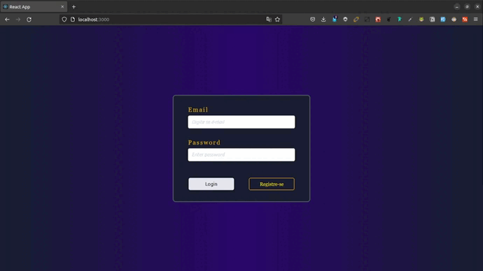

# Desafio Klever(Teste seletivo)

## Funcionalidades

O Desafio Técnico consiste em criar uma API com Golang que expõe endpoints de serviço de upvote onde você pode votar em suas criptomoedas favoritas (Bitcoin, Ethereum, Litecoin, etc). Requerimentos técnicos:

    Os parâmetros recebidos por esta API nas requisições e respostas devem garantir a digitação do usuário final fazendo a devida validação. 

		Ex.: Se uma entrada for esperada como uma string, ela só pode ser recebida como uma string.

    O status HTTP de cada cenário implementado deve respeitar os padrões do Código de Status W3C 

    As estruturas usadas com o modelo upvote devem suportar Marshal/Unmarshal com bson, json e struct
    A API deve conter teste de unidade dos métodos que usa 

## 🛠️ Construído com

   

# APP:
https://desafio-criptomoedas.vercel.app/
  

## ✒️ Autores

Ary Barbosa 
aryhertonbarbosa@gmail.com  

<a href="https://github.com/aryherton">github</a>  
<a href="https://www.linkedin.com/in/aryherton/"> linkedin</a>  

Gratidão

 😊